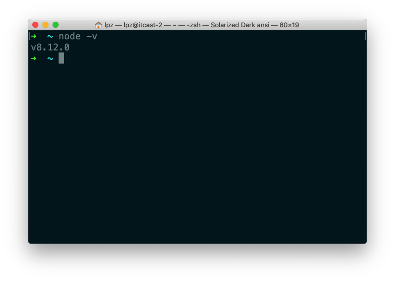
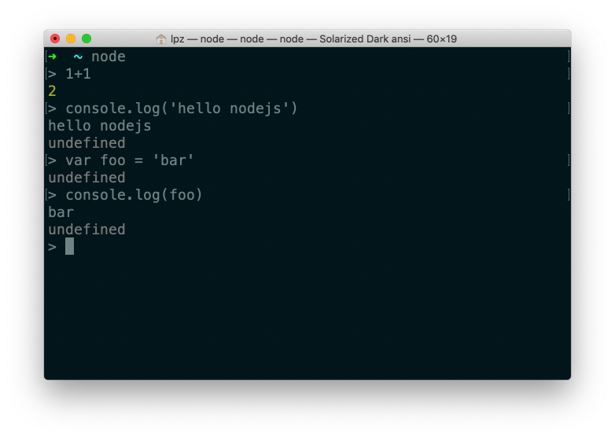
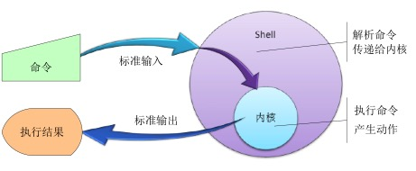

# 第3章 起步

---

## 安装 Node 环境

下载

- 下载地址：https://nodejs.org/en/download/
- 版本说明
  - LTS 长期支持版，适用于开发和生产环境
  - Current 最新版，适用于体验测试

安装

- 傻瓜式的一路 `next` 就可以了


确认是否安装成功

- 打开命令行，输入 `node --version` 或者 `node -v`
	- 注意：如果是安装之前打开的命令行请在安装结束之后关闭重新打开再执行上述命令



---

## REPL

> 类似于浏览器中的 Console ，可以做一些基本的代码测试。
>
> - R：Read 读取
> - E：Eval 执行
> - P：Print 输出
> - L：Loop 循环

- 进入
  - 输入 `node` 回车即可
- 使用
- 离开
  - 按住 `Ctrl` 不要丢，`c` 两次即可退出



---

## 命令行操作


在电影中一个“超级黑客”坐在电脑前，从不摸一下鼠标， 就能够在 30 秒内侵入到超安全的军事计算机中。 这是因为电影制片人意识到， 作为人类，本能地知道让计算机圆满完成工作的唯一途径，是用键盘来操纵计算机。

现在，大多数的计算机用户只是熟悉图形用户界面（GUI），并且产品供应商和此领域的学 者会灌输给用户这样的思想，命令行界面（CLI）是过去使用的一种很恐怖的东西。这就很不 幸，因为一个好的命令行界面，是用来和计算机进行交流沟通的非常有效的方式，正像人类社 会使用文字互通信息一样。人们说， **图形用户界面让简单的任务更容易完成，而命令行界面 使完成复杂的任务成为可能** ，到现在这句话仍然很正确。



当使用图形用户界面时，我们需要另一个和 shell 交互的叫做终端仿真器的程序。 在 Windows 上，一般使用操作系统自带的 `cmd` 或者 `powershell`。 在 Linux 上，如果是图形用户界面，那么可以使用 `terminal` 或者 `konsole`、`gnome-terminal`之类 的终端仿真器，但基本上，它们都完成同样的事情，让我们能访问 shell， 你可能会因为附加的一些花俏功能而喜欢上某个终端。

关于名字，如果有人提到：控制台、终端、bash、shell、terminal 等，一般都是指上面这些。


打开命令行

- 方式一：开始菜单搜索 `cmd`
- 方式二：`win` + `r` 输入 `cmd`

常用命令

- pwd（print working directory）
- cd（change directory）
  - 切换到指定路径（相对路径或绝对路径）
- ls（list files）
  - `ls` 列出当前目录文件
  - `ls 目录路径` 列出指定路径文件
  - `ls -a` 列出文件并显示隐藏文件或目录
- cp（copy）
  - `cp 源路径 目标路径`
  - cp 在复制目录的时候，不会复制里面的子文件或子目录
  - -r （recursive）递归复制
- mv（move）：移动文件或者目录，还可以重命名文件或目录
- mkdir（make directory）：创建目录
- rm（remove）：删除文件或目录
  - -rf 递归删除：直接将整个目录包括里面的内容都删掉
- rmdir 目录名称
  - 只能删除空目录
- clear：清屏
- touch 文件名
  - 根据文件名创建新的文件
- cat 文件名
  - 查看指定的文本文件

```bash
# print working directory 打印当前工作目录
pwd

# change directory 切换目录
cd

# 回到上一级目录
cd ..

# directory 列出当前目录列表
dir

# 列出指定路径的目录列表
dir 目录路径

# copy 拷贝
cp 源 目标

# list files 列出目录列表
# 同 dir，仅适用于类 Unix 操作系统
ls

# 创建目录
mkdir

# 删除文件
remove

# 清屏
clear
```

退出命令行

- 直接关闭即可
- 或者输入 `exit` 也可以退出


命令行练习

```
1. 在桌面下创建一个叫做 `itcast` 的目录
2. 在 itcast 目录下，分别创建 `dir1` 和 `dir2` 两个子目录
3. 复制 `code/scripts/main.js` 文件到 `itcast` 目录中
4. 复制 `code` 目录下的 `js` 目录到 `itcast` 目录中
5. 将 `itcast/main.js` 文件重命名为 `main-main.js`
6. 将 `main-main.js` 文件移动到 dir1 中
7. 将 `dir1` 中的 `main-main.js` 文件移动到 dir2 中
8. 将 `itcast/js` 目录删除
```

以后多使用，就会越用越熟。

## Hello World

**1. 新建一个 hello.js 并写入以下示例代码**

```javascript
var message = 'Hello Node.js!'
console.log(message)
```

**2. 打开命令行并定位到 `hello.js` 文件所属目录**

**3. 在命令行中输入 `node hello.js` 回车执行**

> 注意：
> - 文件名不要起名为 `node.js`
> - 文件名或者文件路径最好不要有中文
> - 文件路径或者文件名不要出现空格

---

## 文件读写

文件读取：

```javascript
const fs = require('fs')

fs.readFile('/etc/passwd', (err, data) => {
  if (err) throw err;
  console.log(data);
});
```

文件写入：

```javascript
const fs = require('fs')

fs.writeFile('message.txt', 'Hello Node.js', (err) => {
  if (err) throw err;
  console.log('The file has been saved!');
});
```

---

## HTTP 服务

```javascript
// 接下来，我们要干一件使用 Node 很有成就感的一件事儿
// 你可以使用 Node 非常轻松的构建一个 Web 服务器
// 在 Node 中专门提供了一个核心模块：http
// http 这个模块的职责就是帮你创建编写服务器的

// 1. 加载 http 核心模块
var http = require('http')

// 2. 使用 http.createServer() 方法创建一个 Web 服务器
//    返回一个 Server 实例
var server = http.createServer()

// 3. 服务器要干嘛？
//    提供服务：对 数据的服务
//    发请求
//    接收请求
//    处理请求
//    给个反馈（发送响应）
//    注册 request 请求事件
//    当客户端请求过来，就会自动触发服务器的 request 请求事件，然后执行第二个参数：回调处理函数
server.on('request', function () {
  res.end('Hello Node.js!')
})

// 4. 绑定端口号，启动服务器
server.listen(3000, function () {
  console.log('服务器启动成功，请求访问 http://127.0.0.1:3000/')
})
```

## Node.js 中的 JavaScript

### ECMAScript

### 全局成员

- Class: Buffer
- __dirname
- __filename
- clearImmediate(immediateObject)
- clearInterval(intervalObject)
- clearTimeout(timeoutObject)
- console
- exports
- global
- module
- process
- require()
- setImmediate(callback[, ...args])
- setInterval(callback, delay[, ...args])
- setTimeout(callback, delay[, ...args])

### 模块化

### 异步操作
